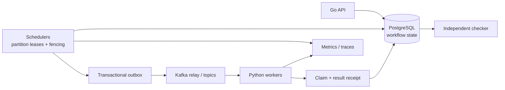

# Distributed Durable Workflow Engine

A Go/Python workflow runtime built around one question: **how do schedulers and
workers recover from crashes, duplicate messages, and stale ownership without
losing committed progress or silently repeating external effects?**

**Stack:** Go, PostgreSQL, Kafka, Python, Docker Compose, OpenTelemetry, Prometheus.
PostgreSQL owns workflow state; Kafka transports dispatch and completion events.
An incident-investigation application adds retrieval, citations, and
approval-gated sandbox actions as a bounded applied-AI use case.

This is an educational systems project with reproducible experiments, not a
production-ready service or a universal exactly-once execution claim.

## Architecture at a glance



The safety boundary is PostgreSQL: Kafka delivery may duplicate, workers may
retry, and schedulers may change ownership, but durable transitions require
the current lease epoch, workflow revision, and attempt token. Effects that
cannot prove their outcome stop in reconciliation instead of being retried
blindly.

## Engineering focus

- **Ownership and concurrency:** partition leases, epoch fencing, ordered row
  locks, exclusive worker claims, and idempotent submission/result receipts.
- **Durable recovery:** explicit workflow graphs, checkpoints, timers, retries,
  fan-out/join, cancellation, and reconciliation of uncertain outcomes.
- **Reliable messaging:** transactional outbox, Kafka relay, durable inbox/offset
  handling, poison-record obligations, and a database-backed repair scan.
- **Effect safety:** cooperating sinks reuse receipts; unknown non-cooperating
  outcomes stop automatic retries. Approval grants bind the resource, canonical
  arguments, revision, and effect identity in the tested integration path.
- **Falsifiable evidence:** named-boundary fault injection, persisted snapshots,
  an independent invariant checker, and negative controls that make it fail.

## Three measured findings

These single-host Docker Desktop/WSL2 measurements predate the current deployed
scheduler/Kafka-worker wiring. They describe the named study harnesses, **not
end-to-end throughput or latency of the current deployment**. A deployed rerun
must be a separate campaign.

1. **Scheduler capacity:** with a fixed four-process worker pool, two schedulers
   kept up with the tested 2 workflows/s offered rate where one scheduler did
   not on the engine path. [DUR-026 evidence](experiments/m7/dur026/results.json)
2. **Transport tradeoff:** notification-direct was faster than Kafka at the
   resolved terminal stage in the quoted campaign. The ready-to-claim comparison
   was unresolved and varied across campaigns; no stable dispatch-stage gain is
   claimed. [DUR-035 evidence](experiments/m7/dur035/results.json)
3. **Checkpoint cost:** at one SHA-256 work unit per chunk, every-chunk
   checkpointing took 7.5552 times the boundary-only median under the recorded
   in-process panic workload. This is neither a general checkpoint policy nor a
   crossover estimate. [DUR-028 evidence](experiments/m7/dur028/results.json)

The [48/48 named-fault campaign](experiments/m5/f01-f11-results.json) is separate
bounded validation evidence, not a comparative performance result. The safeguard
ablation resolved no cost effect because repeated runs were too variable.
The committed experiment artifacts carry the configurations, computed
conclusions, limitations, and claim-to-evidence boundaries. Detailed
engineering records are kept locally rather than published as recruiter-facing
documentation.

### Scoped recovery case study

The committed local portfolio run exercised two failure modes: an owner process
crash and an owner pause followed by stale resumption. Across 60 episodes it
recorded 60 takeovers, 60 useful recoveries, 180 fenced stale-owner writes,
and zero false takeovers. The source harness confirmed the crash targets were
dead and the paused owners were stale after resumption. The [protocol and
summary](experiments/portfolio/local-recovery/local-410041/summary.json) carry
the seed, counts, and timing ranges.

This is local Docker Desktop/WSL2 process evidence, not a two-host or
database-host durability result. The known R096 case — a scheduler stalled
while holding the lease-row lock — is intentionally excluded from the
`local-410041` arm; the repair itself is verified separately.
The local result therefore demonstrates stale-owner fencing and affected-work
progress within its boundary; the excluded lock-held arm is a campaign-scope
limitation, not an unresolved repair.

Claude's round-55 review verified the R096 repair. It preserves
the in-transaction lease fence while bounding lock acquisition and scheduler
iterations. The new preserved-process isolation result is recorded in the
[scenario-1 summary](experiments/portfolio/local-recovery/isolation-410099/summary.json).

Supporting AI evidence remains separately scoped: the live-model evaluation
achieved 4/20 safe outcomes per retrieval arm, versus 20/20 for its fixture
control. Adversarial excess proposal-change rates were 2/20 defended versus
6/20 plain above their clean-clean baselines. These are small synthetic studies,
not production model-quality claims. [Evaluation evidence](experiments/m7/dur029/live-evaluation.json)

## Run locally

Prerequisites: Git, Go with `GOTOOLCHAIN=auto` (module pin Go 1.27.1),
CPython 3.12.7, uv 0.9.5 or newer, Docker Desktop 29.7.2 or newer with
Docker Compose v5, and PowerShell 7 or Windows PowerShell 5.1.

```powershell
pwsh ./scripts/bootstrap.ps1 -StartServices
pwsh ./scripts/local-demo.ps1
```

If `pwsh` is unavailable, use Windows PowerShell, for example:

```powershell
powershell.exe -NoProfile -ExecutionPolicy Bypass -File ./scripts/bootstrap.ps1 -StartServices
```

Bootstrap creates a gitignored `.env`, installs locked dependencies, builds
containers, applies migrations, and checks service health. The demo submits via
the API, executes Python activities through Kafka, and checks the durable result
with the independent invariant checker.

The local stack contains two Go scheduler/API replicas, two Python Kafka worker
processes with four slots each, PostgreSQL 18.6, Kafka 4.3.1, OpenTelemetry
Collector 0.160.0, and Prometheus 3.13.0 LTS. All containers share one Docker
Desktop Linux VM. PostgreSQL uses data checksums and enabled durability settings.

- Runtime health: <http://localhost:8080/healthz>, <http://localhost:8081/healthz>
- Worker health: <http://localhost:8181/healthz>, <http://localhost:8182/healthz>
- Prometheus: <http://localhost:9090>

The deployed demo scans the `local-runtime` namespace and allows only
`pure.echo/v1` and `pure.add/v1`. Unsupported activities pause instead of
executing. Approval/effect execution is covered by the separate production-path
integration test; the default deployment does not run remediation or paid models.
See the [API reference](api/README.md) for the public endpoint surface.

## Validation

```powershell
# Formatting, lint, types, unit tests, and Go race checks.
pwsh ./scripts/ci.ps1 -WithRace

# Real PostgreSQL/Kafka integration; serializes shared database fixtures.
pwsh ./scripts/ci.ps1 -WithServices -WithRace

# Verify committed fault traces against their durable snapshots, offline.
pwsh ./scripts/m5-archive-check.ps1
```

Service-mode CI temporarily stops runtime/worker services to isolate fixtures
and restores them afterward; run it in an isolated development environment.
These commands make no paid model calls. Add `-WithM5` to service-mode CI only
when intentionally rerunning the live fault campaign.

For clean-source, fresh-volume reproduction and restart checks, use the
bootstrap commands above. Ordinary stop/resume preserves data:

```powershell
docker compose --env-file .env -f deploy/local/compose.yaml down
docker compose --env-file .env -f deploy/local/compose.yaml up -d --wait
```

Adding `--volumes` to `down` permanently deletes local dependency data.

## Design and evidence

- [Experiment reproduction notes](experiments/README.md)
- [Portfolio recovery campaign scope](experiments/portfolio/README.md)

## Operating limits

- APIs are development-only, unauthenticated, and localhost-bound by default.
  Do not expose them to untrusted clients.
- **R096 repair verified:**
  a scheduler stalled inside a transaction can retain the lease-row lock beyond
  lease expiry and block takeover. Claude's round-55 review verified the
  committed repair: it bounds lock acquisition and scheduler iterations with a
  distinct retryable error while preserving the fence. The historical local
  campaign still does not establish multi-host scheduler liveness.
- Single-host evidence does not establish multi-host durability, database HA,
  host-loss recovery, sustained production load, or arbitrary exactly-once effects.
- Historical studies, deterministic fixtures, and the deployed pure-activity
  demo have different scopes; their results are not interchangeable.
- The existing `v0.1.0` tag identifies `7e4137d`; this branch includes later
  corrections. No tag is moved by this documentation cleanup.
