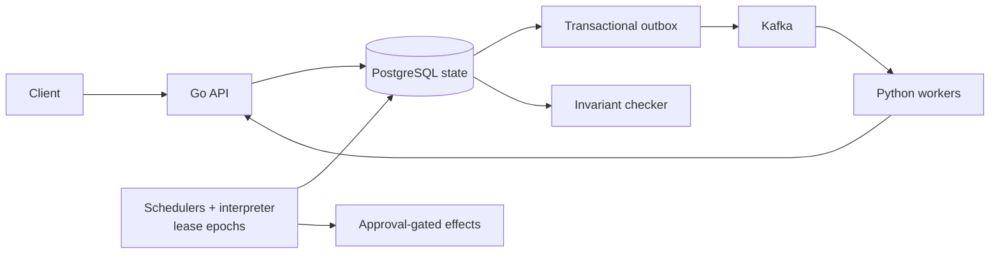

# Distributed Durable Workflow Engine

[](https://github.com/XiaoyunYin/Distributed-Durable-Workflow-Engine/actions/workflows/ci.yml)

**Problem:** recover committed workflows safely across scheduler failover,
duplicate delivery, worker retries, and uncertain external effects. **Stack:**
Go, PostgreSQL, Kafka, Python, Docker, OpenTelemetry, and Prometheus, plus a
bounded retrieval-and-approval incident-investigation example.

## Architecture



## Evidence highlights

- **AWS lease fencing:** the four-arm DUR-049 campaign's independent checker
  found zero superseded-epoch transitions; the preserved worker's late result
  was rejected as `STALE_ATTEMPT`. [Network episode](experiments/portfolio/cloud-recovery/dur049-aws-20260923-full-0adbac0/network-isolation.json).
  Cold standby, one region and one dependency host; not database-host durability.
- **Local recovery:** 60 takeovers, 60 useful recoveries, 180 fenced stale-owner
  writes and zero false takeovers. [60-episode study](experiments/portfolio/local-recovery/local-410041/summary.json).
  Docker Desktop/WSL2 process faults, not independent-host recovery.
- **Named faults:** 48/48 cases (16 boundaries × 3 seeds) passed the independent
  invariant checker. [Campaign evidence](experiments/m5/f01-f11-results.json).
  This is a bounded case set, not a universal exactly-once proof.
- **Regression gate:** all 17 selected behavioral safety mutations were
  detected in [hosted CI](https://github.com/XiaoyunYin/Distributed-Durable-Workflow-Engine/actions/runs/35941481466),
  alongside a reference model and Go fuzz targets. [Mutation results](mutations/results-powershell.json).
  The gate covers representative guards, not every line.

## Engineering focus

- Partition ownership and lease-epoch fencing.
- Durable workflow recovery and reconciliation.
- Transactional outbox/inbox, duplicate delivery and offset safety.
- Approval-bound effects and explicit uncertain-outcome handling.
- Falsifiable fault evidence, an independent reference model and fuzzing.

## Measurements

- Two schedulers met 2 offered workflows/s where one did not, through the
  in-process engine path with four fixed worker processes; single-host
  Docker Desktop/WSL2, not end-to-end deployed capacity. [DUR-026](experiments/m7/dur026/results.json)
- Notification-direct beat Kafka at the resolved terminal stage; ready-to-claim
  was unresolved in the named campaign. [DUR-035](experiments/m7/dur035/results.json)
- Every-chunk checkpointing took 7.5552× the boundary-only median at one
  SHA-256 work unit per chunk, under an in-process panic model; not a crossover
  estimate. [DUR-028](experiments/m7/dur028/results.json)

PostgreSQL fences transitions by lease epoch, workflow revision, and attempt
token; uncertain external effects stop for reconciliation. This educational
project makes no production-readiness or universal exactly-once claim.

More: [failure case study](experiments/portfolio/recruiter/failure-case-study.md) ·
[role-specific resume claims](experiments/portfolio/recruiter/claim-evidence.md) ·
[scripted demo](demos/recruiter-demo.gif) ([tape and instructions](demos/README.md)).

### Deployed HTTP-to-worker pilot

The local Compose pilot exercises HTTP submission → PostgreSQL → transactional
outbox → Kafka → Python worker → durable receipt, with a normal run and a
worker-kill recovery run. Both artifacts require accepted work to reach a
terminal state; the recovery trace is exported as a coherent W3C trace, and
pure activity produces no effect span because the approved effect service does
not run. [DUR-048 pilot evidence](experiments/m8/dur042-pilot/)

This is local Compose evidence, not AWS, host-failure, production-throughput,
or external-effect evidence.

The four-arm [DUR-049 AWS campaign](experiments/portfolio/cloud-recovery/dur049-aws-20260923-full-0adbac0/protocol.json)
recorded zero superseded-epoch transitions; in its preserved-process network
arm, the original worker's late result was rejected as `STALE_ATTEMPT`
([episode](experiments/portfolio/cloud-recovery/dur049-aws-20260923-full-0adbac0/network-isolation.json)).
The peer was a controller-started cold standby in one region. Owner-lock
reaping, campaign-only timeout overrides, failed-attempt history, cleanup, and
the limits of these measurements are documented in the campaign records and
[failure case study](experiments/portfolio/recruiter/failure-case-study.md).

### Scoped recovery case study

The committed local portfolio run exercised two failure modes: an owner process
crash and an owner pause followed by stale resumption. Across 60 episodes it
recorded 60 takeovers, 60 useful recoveries, 180 fenced stale-owner writes,
and zero false takeovers. The source harness confirmed the crash targets were
dead and the paused owners were stale after resumption. The [protocol and
summary](experiments/portfolio/local-recovery/local-410041/summary.json) carry
the seed, counts, and timing ranges.

This is local Docker Desktop/WSL2 process evidence, not a two-host or
database-host durability result. One case — a scheduler stalled
while holding the lease-row lock — is intentionally excluded from the
`local-410041` arm; the repair itself is verified separately.
The local result therefore demonstrates stale-owner fencing and affected-work
progress within its boundary; the excluded lock-held arm is a campaign-scope
limitation, not an unresolved repair.

The lease-contention repair is independently reviewed and verified. It preserves
the in-transaction lease fence while bounding lock acquisition and scheduler
iterations. The new preserved-process isolation result is recorded in the
[scenario-1 summary](experiments/portfolio/local-recovery/isolation-410099/summary.json).

Supporting AI evidence remains separately scoped: the live-model evaluation
achieved 4/20 safe outcomes per retrieval arm, versus 20/20 for its fixture
control. Adversarial excess proposal-change rates were 2/20 defended versus
6/20 plain above their clean-clean baselines. These are small synthetic studies,
not production model-quality claims. [Evaluation evidence](experiments/m7/dur029/live-evaluation.json)

## Run locally

Prerequisites: Git, Go with `GOTOOLCHAIN=auto` (module pin Go 1.27.1),
CPython 3.12.7, uv 0.9.5 or newer, Docker Desktop 29.7.2 or newer with
Docker Compose v5, and PowerShell 7 or Windows PowerShell 5.1.

```powershell
pwsh ./scripts/bootstrap.ps1 -StartServices
pwsh ./scripts/local-demo.ps1
```

If `pwsh` is unavailable, use Windows PowerShell, for example:

```powershell
powershell.exe -NoProfile -ExecutionPolicy Bypass -File ./scripts/bootstrap.ps1 -StartServices
```

Bootstrap creates a gitignored `.env`, installs locked dependencies, builds
containers, applies migrations, and checks service health. The demo submits via
the API, executes Python activities through Kafka, and checks the durable result
with the independent invariant checker.

The local stack contains two Go scheduler/API replicas, two Python Kafka worker
processes with four slots each, PostgreSQL 18.6, Kafka 4.3.1, OpenTelemetry
Collector 0.160.0, and Prometheus 3.13.0 LTS. All containers share one Docker
Desktop Linux VM. PostgreSQL uses data checksums and enabled durability settings.

- Runtime health: <http://localhost:8080/healthz>, <http://localhost:8081/healthz>
- Worker health: <http://localhost:8181/healthz>, <http://localhost:8182/healthz>
- Prometheus: <http://localhost:9090>

The deployed demo scans the `local-runtime` namespace and allows only
`pure.echo/v1` and `pure.add/v1`. Unsupported activities pause instead of
executing. Approval/effect execution is covered by the separate production-path
integration test; the default deployment does not run remediation or paid models.
See the [API reference](api/README.md) for the public endpoint surface.

## Validation

```powershell
# Formatting, lint, types, unit tests, and Go race checks.
pwsh ./scripts/ci.ps1 -WithRace

# Real PostgreSQL/Kafka integration; serializes shared database fixtures.
pwsh ./scripts/ci.ps1 -WithServices -WithRace

# Verify committed fault traces against their durable snapshots, offline.
pwsh ./scripts/m5-archive-check.ps1

# Mutation gate; point this at a disposable migrated database.
$env:DURABLE_MUTATION_DATABASE_URL = "postgresql://..."
pwsh ./scripts/mutation-gate.ps1
```

Service-mode CI temporarily stops runtime/worker services to isolate fixtures
and restores them afterward; run it in an isolated development environment.
These commands make no paid model calls. Add `-WithM5` to service-mode CI only
when intentionally rerunning the live fault campaign.

For clean-source, fresh-volume reproduction and restart checks, use the
bootstrap commands above. Ordinary stop/resume preserves data:

```powershell
docker compose --env-file .env -f deploy/local/compose.yaml down
docker compose --env-file .env -f deploy/local/compose.yaml up -d --wait
```

Adding `--volumes` to `down` permanently deletes local dependency data.

## Design and evidence

- [Experiment reproduction notes](experiments/README.md)
- [Portfolio recovery campaign scope](experiments/portfolio/README.md)

### Evidence map

The committed fault, measurement, and mutation artifacts are the source of
truth for the claims above. The current deployment exposes bounded Prometheus
counters and gauges for leases, claims, results, relay activity, database work,
workers, and reconciliation age. The local DUR-048 pilot also exports an
end-to-end HTTP-to-Kafka-worker trace for its normal and recovery cases; that
trace is local pilot evidence, not production observability.
The current mutation manifest declares 17 behavioral cases plus one
configuration tripwire. The checked-in [PowerShell results](mutations/results-powershell.json)
and [Bash results](mutations/results-bash.json) are from hosted run
[`35941481466`](https://github.com/XiaoyunYin/Distributed-Durable-Workflow-Engine/actions/runs/35941481466)
on `4f98911`; each records all 18 cases. Both workflow jobs passed on two
consecutive attempts.
The workflow creates and drops a disposable migration-complete database for
both mutation gates after an earlier run exposed shared-database residue from
the preceding service suite. The bounded AWS recovery evidence is published
separately; the required Kubernetes campaign remains future work.
Internal study notes stay local; only concise claim boundaries
and reproducible evidence links are published here.

## Operating limits

- APIs are development-only, unauthenticated, and localhost-bound by default.
  Do not expose them to untrusted clients.
- **Lease-contention repair, verified:**
  a scheduler stalled inside a transaction can retain the lease-row lock beyond
  lease expiry and block takeover. Independent review verified the committed
  repair: it bounds lock acquisition and scheduler iterations with a
  distinct retryable error while preserving the fence.
- The AWS campaign establishes bounded application-host and network-isolation
  recovery only; it does not establish database HA, multi-region durability,
  sustained production load, or arbitrary exactly-once effects.
- Historical studies, deterministic fixtures, and the deployed pure-activity
  demo have different scopes; their results are not interchangeable.
- The existing `v0.1.0` tag identifies `7e4137d`; this branch includes later
  corrections. No tag is moved by this documentation cleanup.
