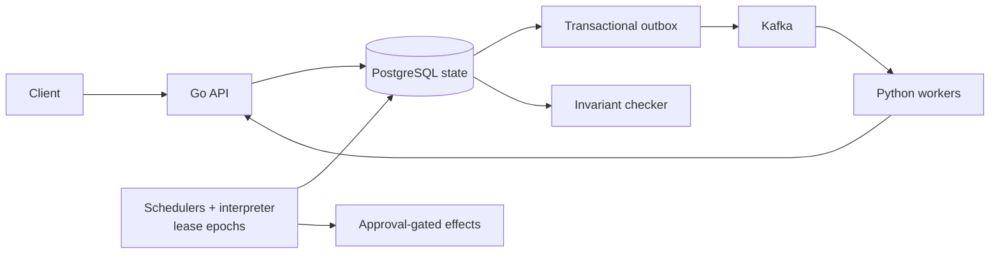

# Distributed Durable Workflow Engine

[](https://github.com/XiaoyunYin/Distributed-Durable-Workflow-Engine/actions/workflows/ci.yml)

**Problem:** recover committed workflows safely across scheduler failover,
duplicate delivery, worker retries, and uncertain external effects. **Stack:**
Go, PostgreSQL, Kafka, Python, Docker, OpenTelemetry, and Prometheus, plus a
bounded retrieval-and-approval incident-investigation example.

## Architecture



## Evidence highlights

- **Scheduler capacity:** two schedulers kept up at 2 offered workflows/s
  where one did not, on the in-process engine path with four fixed workers.
  [Study](experiments/m7/dur026/results.json)
- **Dispatch path:** in one campaign, notification-direct beat Kafka at the
  resolved terminal stage; ready-to-claim was unresolved.
  [Study](experiments/m7/dur035/results.json)
- **Checkpoint cost:** every-chunk took 7.5552x the boundary-only median at one
  SHA-256 work unit/chunk. [Study](experiments/m7/dur028/results.json)

Separate validation: [48/48 named-fault cases](experiments/m5/f01-f11-results.json).
Performance studies are single-host Docker Desktop/WSL2 harness results, not
deployed throughput. PostgreSQL fences transitions by lease epoch, workflow
revision, and attempt token; uncertain external effects stop for reconciliation.
This educational project makes no production-readiness or universal
exactly-once claim.

More: [failure case study](experiments/portfolio/recruiter/failure-case-study.md) ·
[role-specific resume claims](experiments/portfolio/recruiter/claim-evidence.md) ·
[scripted demo](demos/recruiter-demo.gif) ([tape and instructions](demos/README.md)).

### Deployed HTTP-to-worker pilot

The local Compose pilot exercises HTTP submission → PostgreSQL → transactional
outbox → Kafka → Python worker → durable receipt, with a normal run and a
worker-kill recovery run. Both artifacts require accepted work to reach a
terminal state; the recovery trace is exported as a coherent W3C trace, and
pure activity produces no effect span because the approved effect service does
not run. [DUR-048 pilot evidence](experiments/m8/dur042-pilot/)

This is local Compose evidence, not AWS, host-failure, production-throughput,
or external-effect evidence.

A separate [DUR-049 AWS campaign](experiments/portfolio/cloud-recovery/dur049-aws-20260923-round80-final/protocol.json)
ran two repetitions each of preserved-process network isolation, forced
application-host stop, and live-holder lease-row-lock contention. All six
episodes passed their recorded gates with zero superseded-epoch transitions.
That lock arm measures bounded waiting while a healthy external holder
contends on one partition; it is not isolation of the owning scheduler while
it holds the row lock. A later [full four-arm AWS rerun](experiments/portfolio/cloud-recovery/dur049-aws-20260923-full-0adbac0/protocol.json)
on commit `0adbac0` passed preserved-process network isolation, forced
application-host stop, live-holder contention, and isolation of the original
scheduler while it held the lease-row lock. In the owner-lock arm, PostgreSQL
was observed to be reaped after TCP keepalive failure; a peer took over,
consumed the already-recorded result, and made useful progress; the same
original runtime reconnected and its stale lease write was rejected without
changing the stable lease row. The independent live and offline invariant
checks passed, with zero superseded-epoch transitions. The target transaction
overrode the production 10-second idle-in-transaction timeout with a
campaign-only 120-second timeout, so that production timeout path was not
measured. The backend was reaped about 62 seconds after its last activity,
consistent with the observed TCP keepalive settings (30-second idle plus three
10-second probes). The same-owner stale-epoch control retained its workflow as CANCELED,
recorded zero outbox rows, rejected the old epoch without a revision change,
and left the global open-obligation set unchanged after consumer drain.
The accompanying [cleanup record](experiments/portfolio/cloud-recovery/dur049-aws-20260923-full-0adbac0/cleanup.json)
documents destruction and post-destroy absence checks for the campaign
resources; invoice attribution was not queried. Four strict network-only runs
(two embedded in the round 80/81 campaigns and two standalone) in
[round 86](experiments/portfolio/cloud-recovery/dur049-aws-20260923-round86-network-final/protocol.json)
and [round 87](experiments/portfolio/cloud-recovery/dur049-aws-20260923-round87-network-final/protocol.json)
disabled server-side PostgreSQL session termination, preserved the original
runtime and worker, and observed the original worker's late result rejected as
`STALE_ATTEMPT`. The peer was a controller-started cold standby, and recovery
timings are bounded by the 30-second attempt lease and 60-second fixture; they
are not general failover-performance estimates. The tested activity was pure,
so zero effect calls does not test external-effect deduplication. The
[attempt ledger](experiments/portfolio/cloud-recovery/dur049-attempt-ledger.md)
retains failed, incomplete, missing, and passing attempt history, including
eight early network-only failures whose cause cannot be determined from the
retained observations. The [closeout report](experiments/portfolio/cloud-recovery/dur049-aws-20260923-closeout/closeout.json)
records Terraform teardown and a gross reconstructed price estimate of about
$0.78, not a final invoice. Five global poison-record items recorded at
teardown are attributed to the historical same-owner epoch negative-control
probe: it created a `workflow.created` event and then deleted the workflow
row, so the consumer correctly quarantined the orphan. Their workflow-ID
mapping is inferred from retained probe results and run timestamps; the
original Kafka payload bytes were not retained. The campaign probe now
suppresses its outbox event, retains and terminalizes its workflow, and checks
that a drained scheduler consumer leaves the global open-obligation set
unchanged. This is bounded application-host recovery evidence, not
database-host durability, multi-region HA, or production-scale reliability
evidence.

The hosted CI runs for the commits that produced the round 80/81 and 86/87
artifacts failed; each protocol records the exact run and failed steps. The
campaign measurements are not presented as having come from green-CI commits.

### Scoped recovery case study

The committed local portfolio run exercised two failure modes: an owner process
crash and an owner pause followed by stale resumption. Across 60 episodes it
recorded 60 takeovers, 60 useful recoveries, 180 fenced stale-owner writes,
and zero false takeovers. The source harness confirmed the crash targets were
dead and the paused owners were stale after resumption. The [protocol and
summary](experiments/portfolio/local-recovery/local-410041/summary.json) carry
the seed, counts, and timing ranges.

This is local Docker Desktop/WSL2 process evidence, not a two-host or
database-host durability result. One case — a scheduler stalled
while holding the lease-row lock — is intentionally excluded from the
`local-410041` arm; the repair itself is verified separately.
The local result therefore demonstrates stale-owner fencing and affected-work
progress within its boundary; the excluded lock-held arm is a campaign-scope
limitation, not an unresolved repair.

The lease-contention repair is independently reviewed and verified. It preserves
the in-transaction lease fence while bounding lock acquisition and scheduler
iterations. The new preserved-process isolation result is recorded in the
[scenario-1 summary](experiments/portfolio/local-recovery/isolation-410099/summary.json).

Supporting AI evidence remains separately scoped: the live-model evaluation
achieved 4/20 safe outcomes per retrieval arm, versus 20/20 for its fixture
control. Adversarial excess proposal-change rates were 2/20 defended versus
6/20 plain above their clean-clean baselines. These are small synthetic studies,
not production model-quality claims. [Evaluation evidence](experiments/m7/dur029/live-evaluation.json)

## Run locally

Prerequisites: Git, Go with `GOTOOLCHAIN=auto` (module pin Go 1.27.1),
CPython 3.12.7, uv 0.9.5 or newer, Docker Desktop 29.7.2 or newer with
Docker Compose v5, and PowerShell 7 or Windows PowerShell 5.1.

```powershell
pwsh ./scripts/bootstrap.ps1 -StartServices
pwsh ./scripts/local-demo.ps1
```

If `pwsh` is unavailable, use Windows PowerShell, for example:

```powershell
powershell.exe -NoProfile -ExecutionPolicy Bypass -File ./scripts/bootstrap.ps1 -StartServices
```

Bootstrap creates a gitignored `.env`, installs locked dependencies, builds
containers, applies migrations, and checks service health. The demo submits via
the API, executes Python activities through Kafka, and checks the durable result
with the independent invariant checker.

The local stack contains two Go scheduler/API replicas, two Python Kafka worker
processes with four slots each, PostgreSQL 18.6, Kafka 4.3.1, OpenTelemetry
Collector 0.160.0, and Prometheus 3.13.0 LTS. All containers share one Docker
Desktop Linux VM. PostgreSQL uses data checksums and enabled durability settings.

- Runtime health: <http://localhost:8080/healthz>, <http://localhost:8081/healthz>
- Worker health: <http://localhost:8181/healthz>, <http://localhost:8182/healthz>
- Prometheus: <http://localhost:9090>

The deployed demo scans the `local-runtime` namespace and allows only
`pure.echo/v1` and `pure.add/v1`. Unsupported activities pause instead of
executing. Approval/effect execution is covered by the separate production-path
integration test; the default deployment does not run remediation or paid models.
See the [API reference](api/README.md) for the public endpoint surface.

## Validation

```powershell
# Formatting, lint, types, unit tests, and Go race checks.
pwsh ./scripts/ci.ps1 -WithRace

# Real PostgreSQL/Kafka integration; serializes shared database fixtures.
pwsh ./scripts/ci.ps1 -WithServices -WithRace

# Verify committed fault traces against their durable snapshots, offline.
pwsh ./scripts/m5-archive-check.ps1

# Mutation gate; point this at a disposable migrated database.
$env:DURABLE_MUTATION_DATABASE_URL = "postgresql://..."
pwsh ./scripts/mutation-gate.ps1
```

Service-mode CI temporarily stops runtime/worker services to isolate fixtures
and restores them afterward; run it in an isolated development environment.
These commands make no paid model calls. Add `-WithM5` to service-mode CI only
when intentionally rerunning the live fault campaign.

For clean-source, fresh-volume reproduction and restart checks, use the
bootstrap commands above. Ordinary stop/resume preserves data:

```powershell
docker compose --env-file .env -f deploy/local/compose.yaml down
docker compose --env-file .env -f deploy/local/compose.yaml up -d --wait
```

Adding `--volumes` to `down` permanently deletes local dependency data.

## Design and evidence

- [Experiment reproduction notes](experiments/README.md)
- [Portfolio recovery campaign scope](experiments/portfolio/README.md)

### Evidence map

The committed fault, measurement, and mutation artifacts are the source of
truth for the claims above. The current deployment exposes bounded Prometheus
counters and gauges for leases, claims, results, relay activity, database work,
workers, and reconciliation age. The local DUR-048 pilot also exports an
end-to-end HTTP-to-Kafka-worker trace for its normal and recovery cases; that
trace is local pilot evidence, not production observability.
The current mutation manifest declares 17 behavioral cases plus one
configuration tripwire. The checked-in [PowerShell results](mutations/results-powershell.json)
and [Bash results](mutations/results-bash.json) are from hosted run
[`35941481466`](https://github.com/XiaoyunYin/Distributed-Durable-Workflow-Engine/actions/runs/35941481466)
on `4f98911`; each records all 18 cases. Both workflow jobs passed on two
consecutive attempts.
The workflow creates and drops a disposable migration-complete database for
both mutation gates after an earlier run exposed shared-database residue from
the preceding service suite. The bounded AWS recovery evidence is published
separately; the required Kubernetes campaign remains future work.
Internal study notes stay local; only concise claim boundaries
and reproducible evidence links are published here.

## Operating limits

- APIs are development-only, unauthenticated, and localhost-bound by default.
  Do not expose them to untrusted clients.
- **Lease-contention repair, verified:**
  a scheduler stalled inside a transaction can retain the lease-row lock beyond
  lease expiry and block takeover. Independent review verified the committed
  repair: it bounds lock acquisition and scheduler iterations with a
  distinct retryable error while preserving the fence.
- The AWS campaign establishes bounded application-host and network-isolation
  recovery only; it does not establish database HA, multi-region durability,
  sustained production load, or arbitrary exactly-once effects.
- Historical studies, deterministic fixtures, and the deployed pure-activity
  demo have different scopes; their results are not interchangeable.
- The existing `v0.1.0` tag identifies `7e4137d`; this branch includes later
  corrections. No tag is moved by this documentation cleanup.
